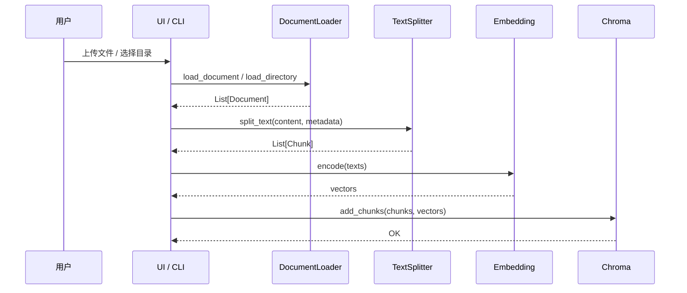
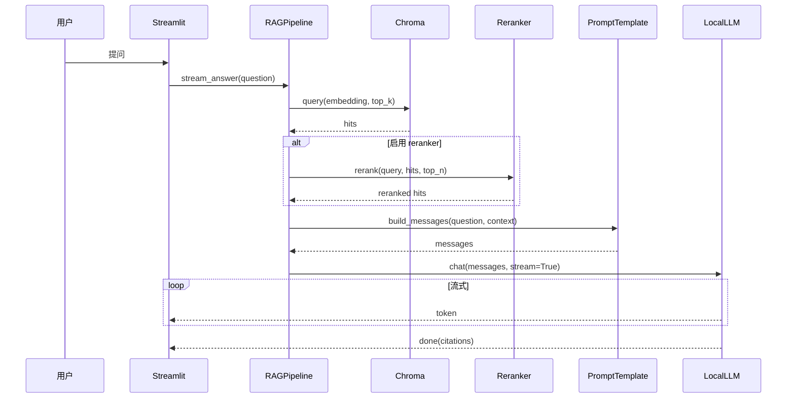

# 系统架构说明

## 1. 总体架构

```mermaid
flowchart LR
    subgraph 用户端
        U[用户浏览器]
    end

    subgraph 应用层
        UI[Streamlit Web UI<br/>ui/app.py]
        CLI[CLI 脚本<br/>scripts/ingest.py<br/>scripts/query.py<br/>scripts/evaluate.py]
    end

    subgraph RAG 流水线层
        RP[RAGPipeline<br/>src/rag_pipeline.py]
        DL[DocumentLoader<br/>src/document_loader.py]
        TS[ChineseTextSplitter<br/>src/text_splitter.py]
        EM[EmbeddingModel<br/>src/embeddings.py]
        VS[(Chroma Vector Store<br/>src/vector_store.py)]
        RR[Reranker (可选)<br/>src/reranker.py]
        PT[PromptTemplate<br/>src/prompt_template.py]
    end

    subgraph 推理层
        LLM[LocalLLM<br/>src/llm.py<br/>HuggingFace transformers<br/>+ bitsandbytes 4bit]
    end

    subgraph 数据与配置
        CFG[config/config.yaml]
        PRM[config/prompts.yaml]
        RAW[(data/raw 原始文档)]
        EVAL[(data/eval 评估集)]
    end

    U --> UI
    UI --> RP
    CLI --> DL
    CLI --> TS

    DL --> RAW
    DL --> TS
    TS --> EM
    EM --> VS
    RP --> VS
    RP --> RR
    RP --> PT
    RP --> LLM
    PT -.读取.-> PRM
    RP -.读取.-> CFG
    CLI -.读取.-> CFG
    UI -.读取.-> CFG
```

## 2. 关键流程

### 2.1 文档入库流程



### 2.2 RAG 问答流程



## 3. 模块职责

| 模块 | 文件 | 职责 |
|------|------|------|
| DocumentLoader | `src/document_loader.py` | 解析 PDF/DOCX/MD/TXT，返回统一 `Document` |
| TextSplitter | `src/text_splitter.py` | 中文智能分块（按段/句/标点优先级） |
| Embedding | `src/embeddings.py` | 封装 `sentence-transformers`，支持归一化、批处理 |
| VectorStore | `src/vector_store.py` | 封装 `Chroma` 持久化客户端，支持增删查 |
| Reranker | `src/reranker.py` | 基于 BGE / CrossEncoder 的重排（可选） |
| LLM | `src/llm.py` | 封装 transformers，支持 4bit 量化与流式生成 |
| PromptTemplate | `src/prompt_template.py` | 中文 RAG Prompt 模板与引用格式化 |
| RAGPipeline | `src/rag_pipeline.py` | 串联 检索→重排→生成 的主流程 |
| UI | `ui/app.py` | Streamlit 多页面交互界面 |
| Analytics Page | `ui/page_modules/analytics.py` | 📊 指标可视化页面（Plotly 图表 + 历史趋势对比 + 详情表 + HTML 导出） |
| Scripts | `scripts/*.py` | 命令行入库、查询、评估 |

## 4. 数据流向

1. **离线入库**：原始文档 → 解析 → 分块 → Embedding → Chroma 持久化
2. **在线问答**：用户问题 → Embedding → 向量检索 Top-K →（重排）→ Prompt 组装 → LLM 生成 → 流式返回 + 引用

## 5. 配置与扩展

- `config/config.yaml` 集中管理：模型路径、chunk 参数、设备、量化、检索参数
- `config/prompts.yaml` 中可自定义 system / user 模板，无需修改代码
- `src/embeddings.py` / `src/llm.py` 均为可替换实现：未来可切换到不同的 embedding 服务或本地推理后端

## 6. 性能瓶颈与优化

| 环节 | 瓶颈 | 优化手段 |
|------|------|---------|
| Embedding | CPU 上句子较长时较慢 | 选用小模型 bge-small-zh；启用 GPU；批处理 |
| 检索 | 向量维度大 / 数据量多 | HNSW 参数调优；metadata 过滤；Top-K 控制 |
| LLM 推理 | 显存不足 | 4bit 量化；切到 CPU（牺牲速度）；换更小模型 |
| 流式输出 | 多并发用户 | Streamlit 单线程；后续可换 FastAPI + WebSocket |

## 7. 安全与隔离

- 所有数据本地化，无外部网络请求（除模型首次下载）
- 配置文件不包含敏感信息；如需 API Key，使用 `.env` 而非 `config.yaml`
- `.gitignore` 默认排除 `data/raw/`、`data/chroma_db/`、模型缓存